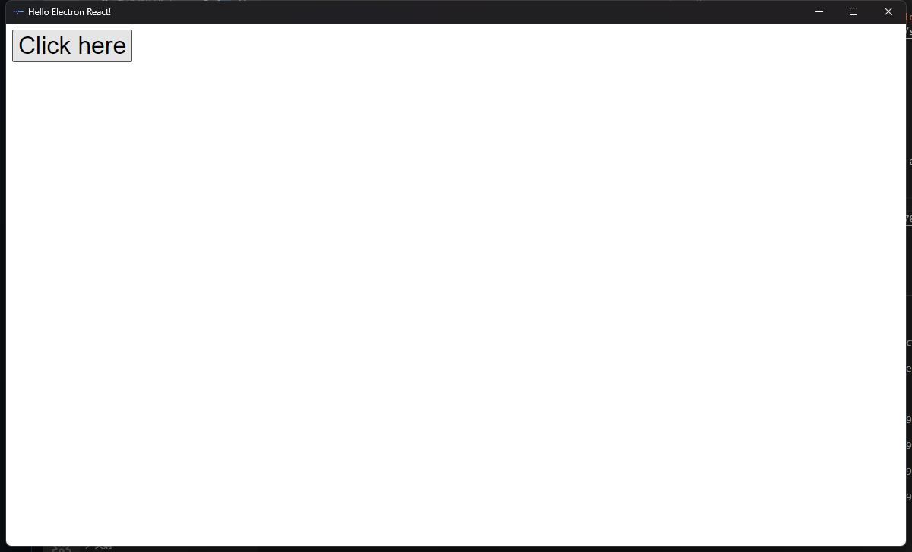
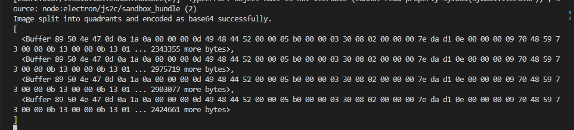
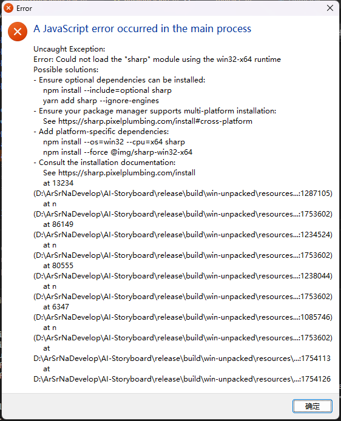

# Sharp Issue Test

linking to [https://github.com/lovell/sharp/issues/3924](https://github.com/lovell/sharp/issues/3924)

# Reproduce

## development

- Install: `pnpm i`
- start: `npm start`

Click the button, it will split an image to 4 pieces automatically.

## Package

`npm run package`

